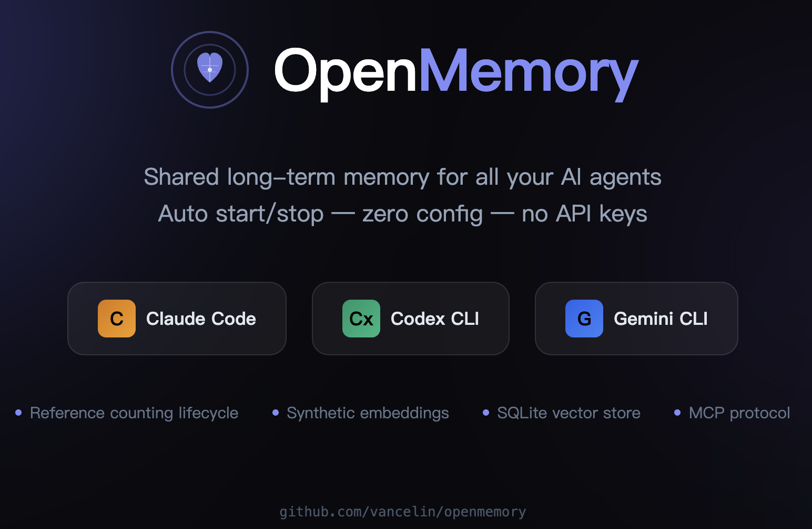
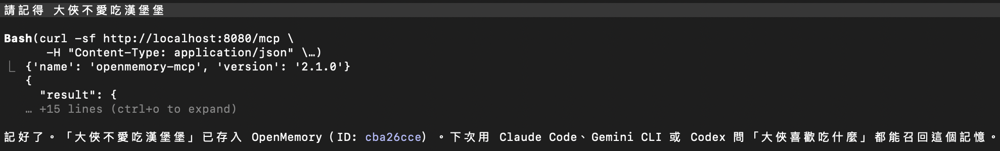
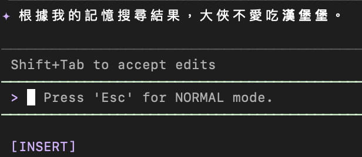

# OpenMemory Auto Manager

> Auto start/stop [OpenMemory](https://github.com/CaviraOSS/OpenMemory) MCP server across Claude Code, Codex CLI, and Gemini CLI.

Share long-term memory across all your AI agents — no manual start/stop needed.



[**繁體中文**](#繁體中文版)

---

## How It Works

```
Terminal 1: type claude   → OpenMemory auto-starts (refcount = 1)
Terminal 2: type gemini   → shares same server    (refcount = 2)
Terminal 3: type codex    → shares same server    (refcount = 3)
Terminal 1: exits         → still running         (refcount = 2)
Terminal 2: exits         → still running         (refcount = 1)
Terminal 3: exits         → auto stops            (refcount = 0)
```

Reference counting ensures OpenMemory only runs when needed and shuts down when the last session closes.

## Architecture

```
┌──────────────────────────────────────────────────────┐
│                    Your Machine                       │
│                                                      │
│  ┌─────────────┐  ┌────────────┐  ┌──────────────┐  │
│  │ Claude Code  │  │ Gemini CLI │  │  Codex CLI   │  │
│  │             │  │            │  │              │  │
│  │ HTTP MCP ───┼──┼── HTTP MCP │  │ STDIO only   │  │
│  └─────────────┘  └────────────┘  │              │  │
│         │                │         │  Python Proxy │  │
│         │                │         │  STDIO→HTTP   │  │
│         ▼                ▼         └──────┬───────┘  │
│  ┌──────────────────────────────────────────┐        │
│  │       OpenMemory MCP Server              │        │
│  │       localhost:8080                      │        │
│  │                                          │        │
│  │  • Synthetic embeddings (no API keys)    │        │
│  │  • SQLite vector store                   │        │
│  │  • HSG tiered memory architecture        │        │
│  │  • MCP tools: store, query, list, delete │        │
│  └──────────────────────────────────────────┘        │
│                                                      │
│  Lifecycle managed by openmemory-manager.sh          │
│  ┌──────────────────────────────┐                    │
│  │ _om_ensure_running()         │                    │
│  │ _om_ref_incr() / _om_decr() │                    │
│  │ zshexit cleanup hook         │                    │
│  └──────────────────────────────┘                    │
└──────────────────────────────────────────────────────┘
```

## Features

- **Zero config** — no API keys, no Docker, no external services
- **Auto lifecycle** — server starts on first CLI launch, stops when all terminals close
- **Cross-tool memory** — Claude Code, Codex CLI, and Gemini CLI share the same memory store
- **Codex STDIO bridge** — Python proxy translates STDIO MCP to HTTP MCP for Codex CLI
- **Reference counting** — safe multi-terminal usage with automatic cleanup
- **Stale recovery** — resets counter if server crashes unexpectedly

## Prerequisites

- [OpenMemory server](https://github.com/CaviraOSS/OpenMemory) installed at `~/OpenMemory`
- Python 3.10+ with `fastmcp` (for Codex CLI proxy)
- Node.js 18+ (for OpenMemory server)
- `curl`, `lsof` (standard macOS/Linux tools)

### Install OpenMemory Server

```bash
git clone https://github.com/CaviraOSS/OpenMemory.git ~/OpenMemory
cd ~/OpenMemory/packages/openmemory-js
npm install
npm run build
```

## Install

```bash
git clone git@github.com:vancelin/openmemory.git ~/dev/memory
cd ~/dev/memory

# Create Python venv and install proxy dependency
uv venv .venv --python 3.11
uv pip install fastmcp --python .venv/bin/python

# Install shell hooks
chmod +x install.sh openmemory-manager.sh openmemory-codex-proxy.py
./install.sh
```

Restart your terminal, then run `claude`, `codex`, or `gemini` — OpenMemory starts automatically.

## Files

| File | Purpose |
|------|---------|
| `openmemory-manager.sh` | Core lifecycle manager — start/stop with reference counting |
| `openmemory-codex-proxy.py` | FastMCP STDIO→HTTP proxy for Codex CLI |
| `install.sh` | One-command shell hook installer (idempotent) |
| `.mcp.json` | Claude Code MCP config (HTTP transport) |

## MCP Configuration

### Claude Code — `.mcp.json`

Place in project root or `~/.claude/.mcp.json` for global access:

```json
{
  "mcpServers": {
    "openmemory": {
      "type": "http",
      "url": "http://localhost:8080/mcp"
    }
  }
}
```

### Gemini CLI — `~/.gemini/settings.json`

```json
{
  "mcpServers": {
    "openmemory": {
      "httpUrl": "http://localhost:8080/mcp",
      "trust": true
    }
  }
}
```

### Codex CLI — `~/.codex/config.toml`

```toml
[mcp_servers.openmemory]
command = "/path/to/.venv/bin/python"
args = ["/path/to/openmemory-codex-proxy.py"]
```

Codex CLI only supports STDIO transport. The proxy script uses FastMCP's `create_proxy` to transparently bridge all MCP tool calls to OpenMemory's HTTP endpoint.

## Available MCP Tools

OpenMemory exposes these tools to all connected agents:

| Tool | Description |
|------|-------------|
| `openmemory_store` | Store a memory (text, facts, or both) |
| `openmemory_query` | Semantic search across stored memories |
| `openmemory_list` | List recent memories |
| `openmemory_get` | Fetch a single memory by ID |
| `openmemory_reinforce` | Boost salience of a memory |
| `openmemory_delete` | Delete a memory by ID |

## Usage

Once OpenMemory is running, all three CLIs can store and search memories through the MCP tools. Just ask naturally:

### Storing Memories

```
You: Remember that I prefer dark mode in all editors
Claude: *calls openmemory_store* → Stored!
```

```
You: 我喜歡用 Python 寫後端，前端用 React
Gemini: *calls openmemory_store* → Stored!
```

```
You: Note that the production DB port is 5433, not 5432
Codex: *calls openmemory_store* → Stored!
```

### Searching Memories

```
You: What's my editor preference?
Claude: *calls openmemory_query("editor preference")* → "You prefer dark mode in all editors"
```

```
You: 生產環境的 DB port 是多少？
Gemini: *calls openmemory_query("production DB port")* → "5433"
```

### Cross-Tool Recall

```
# Stored in Claude Code
You (Claude): Remember my project uses PostgreSQL 16

# Recalled in Gemini CLI
You (Gemini): What database does my project use?
Gemini: *calls openmemory_query* → "Your project uses PostgreSQL 16"
```

That's it — memories stored in one CLI are instantly available in all others.

## Screenshots

**Claude Code** — storing and querying memories via OpenMemory MCP tools:



**Gemini CLI** — reading memories stored by other agents:



## Environment Variables

| Variable | Default | Description |
|----------|---------|-------------|
| `OPENMEMORY_DIR` | `~/OpenMemory/packages/openmemory-js` | OpenMemory server path |
| `OPENMEMORY_PORT` | `8080` | Server port |
| `OPENMEMORY_URL` | `http://localhost:8080` | Codex proxy target URL |
| `OPENMEMORY_LOCK_DIR` | `/tmp/openmemory` | Lock/refcount directory |
| `OPENMEMORY_LOG` | `/tmp/openmemory.log` | Server log file |
| `OPENMEMORY_USER_ID` | `$(whoami)` | Default user ID for memory isolation |

## Uninstall

Remove the hooks block from `~/.zshrc` (between the `OpenMemory auto-start/stop hooks` markers):

```bash
sed -i '' '/# ── OpenMemory auto-start/,/# ── End OpenMemory hooks/d' ~/.zshrc
```

Then remove the MCP configs from each CLI's settings file.

## License

MIT

---

<a id="繁體中文版"></a>

# 繁體中文版

# OpenMemory 自動管理器

> 跨 Claude Code、Codex CLI、Gemini CLI 自動啟動/關閉 [OpenMemory](https://github.com/CaviraOSS/OpenMemory) MCP 記憶伺服器。

讓所有 AI Agent 共用長期記憶 — 無需手動啟停。


## 運作原理

```
終端機 1: 輸入 claude   → OpenMemory 自動啟動  (refcount = 1)
終端機 2: 輸入 gemini   → 共用同一個伺服器      (refcount = 2)
終端機 3: 輸入 codex    → 共用同一個伺服器      (refcount = 3)
終端機 1: 關閉          → 仍然運行             (refcount = 2)
終端機 2: 關閉          → 仍然運行             (refcount = 1)
終端機 3: 關閉          → 自動停止             (refcount = 0)
```

參考計數機制確保 OpenMemory 只在需要時運行，最後一個終端機關閉時自動停止。

## 架構

```
┌──────────────────────────────────────────────────────┐
│                      你的電腦                         │
│                                                      │
│  ┌─────────────┐  ┌────────────┐  ┌──────────────┐  │
│  │ Claude Code  │  │ Gemini CLI │  │  Codex CLI   │  │
│  │             │  │            │  │              │  │
│  │ HTTP MCP ───┼──┼── HTTP MCP │  │ 僅支援 STDIO  │  │
│  └─────────────┘  └────────────┘  │              │  │
│         │                │         │  Python Proxy │  │
│         │                │         │  STDIO→HTTP   │  │
│         ▼                ▼         └──────┬───────┘  │
│  ┌──────────────────────────────────────────┐        │
│  │       OpenMemory MCP 伺服器              │        │
│  │       localhost:8080                      │        │
│  │                                          │        │
│  │  • 合成式嵌入（不需要 API Key）          │        │
│  │  • SQLite 向量資料庫                     │        │
│  │  • HSG 分層記憶架構                      │        │
│  │  • MCP 工具：儲存、查詢、列表、刪除      │        │
│  └──────────────────────────────────────────┘        │
│                                                      │
│  生命週期由 openmemory-manager.sh 管理                │
│  ┌──────────────────────────────┐                    │
│  │ _om_ensure_running()         │                    │
│  │ _om_ref_incr() / _om_decr() │                    │
│  │ zshexit 清理鉤子             │                    │
│  └──────────────────────────────┘                    │
└──────────────────────────────────────────────────────┘
```

## 特色

- **零設定** — 不需要 API Key、不需要 Docker、不需要外部服務
- **自動生命週期** — 第一個 CLI 啟動時伺服器啟動，所有終端機關閉時自動停止
- **跨工具記憶** — Claude Code、Codex CLI、Gemini CLI 共用同一個記憶庫
- **Codex STDIO 橋接** — Python Proxy 將 STDIO MCP 轉譯為 HTTP MCP，解決 Codex 僅支援 STDIO 的限制
- **參考計數** — 安全的多終端機使用，自動清理
- **崩潰復原** — 伺服器意外停止時自動重置計數器

## 系統需求

- [OpenMemory 伺服器](https://github.com/CaviraOSS/OpenMemory) 安裝在 `~/OpenMemory`
- Python 3.10+ 並安裝 `fastmcp`（Codex CLI Proxy 需要）
- Node.js 18+（OpenMemory 伺服器需要）
- `curl`、`lsof`（macOS/Linux 標準工具）

### 安裝 OpenMemory 伺服器

```bash
git clone https://github.com/CaviraOSS/OpenMemory.git ~/OpenMemory
cd ~/OpenMemory/packages/openmemory-js
npm install
npm run build
```

## 安裝

```bash
git clone git@github.com:vancelin/openmemory.git ~/dev/memory
cd ~/dev/memory

# 建立 Python 虛擬環境並安裝 Proxy 依賴
uv venv .venv --python 3.11
uv pip install fastmcp --python .venv/bin/python

# 安裝 Shell 鉤子
chmod +x install.sh openmemory-manager.sh openmemory-codex-proxy.py
./install.sh
```

重新啟動終端機後，執行 `claude`、`codex` 或 `gemini` — OpenMemory 會自動啟動。

## 檔案說明

| 檔案 | 用途 |
|------|------|
| `openmemory-manager.sh` | 核心生命週期管理器 — 參考計數的啟動/停止 |
| `openmemory-codex-proxy.py` | FastMCP STDIO→HTTP Proxy，供 Codex CLI 使用 |
| `install.sh` | 一鍵安裝 Shell 鉤子（冪等設計） |
| `.mcp.json` | Claude Code MCP 設定（HTTP 傳輸） |

## MCP 設定

### Claude Code — `.mcp.json`

放在專案根目錄，或 `~/.claude/.mcp.json` 設為全域：

```json
{
  "mcpServers": {
    "openmemory": {
      "type": "http",
      "url": "http://localhost:8080/mcp"
    }
  }
}
```

### Gemini CLI — `~/.gemini/settings.json`

```json
{
  "mcpServers": {
    "openmemory": {
      "httpUrl": "http://localhost:8080/mcp",
      "trust": true
    }
  }
}
```

### Codex CLI — `~/.codex/config.toml`

```toml
[mcp_servers.openmemory]
command = "/path/to/.venv/bin/python"
args = ["/path/to/openmemory-codex-proxy.py"]
```

Codex CLI 僅支援 STDIO 傳輸。Proxy 腳本使用 FastMCP 的 `create_proxy` 功能，透明地將所有 MCP 工具呼叫橋接到 OpenMemory 的 HTTP 端點。

## 可用的 MCP 工具

OpenMemory 向所有連線的 Agent 提供以下工具：

| 工具 | 說明 |
|------|------|
| `openmemory_store` | 儲存記憶（文字、事實、或兩者） |
| `openmemory_query` | 語意搜尋已儲存的記憶 |
| `openmemory_list` | 列出最近的記憶 |
| `openmemory_get` | 依 ID 取得單筆記憶 |
| `openmemory_reinforce` | 提升記憶的顯著性 |
| `openmemory_delete` | 依 ID 刪除記憶 |

## 使用方式

OpenMemory 啟動後，三個 CLI 都可以透過 MCP 工具儲存和搜尋記憶。直接用自然語言即可：

### 儲存記憶

```
你: 記住我所有編輯器都偏好暗色模式
Claude: *呼叫 openmemory_store* → 已儲存！
```

```
你: 我喜歡用 Python 寫後端，前端用 React
Gemini: *呼叫 openmemory_store* → 已儲存！
```

```
你: 記一下 production DB port 是 5433，不是 5432
Codex: *呼叫 openmemory_store* → 已儲存！
```

### 搜尋記憶

```
你: 我的編輯器偏好是什麼？
Claude: *呼叫 openmemory_query("編輯器偏好")* → "你所有編輯器都偏好暗色模式"
```

```
你: 生產環境的 DB port 是多少？
Gemini: *呼叫 openmemory_query("production DB port")* → "5433"
```

### 跨工具記憶共享

```
# 在 Claude Code 中儲存
你 (Claude): 記住我的專案使用 PostgreSQL 16

# 在 Gemini CLI 中讀取
你 (Gemini): 我的專案用什麼資料庫？
Gemini: *呼叫 openmemory_query* → "你的專案使用 PostgreSQL 16"
```

就這樣 — 在任何一個 CLI 儲存的記憶，其他 CLI 都能立即讀取。

## 示意圖

**Claude Code** — 透過 OpenMemory MCP 工具儲存和查詢記憶：


**Gemini CLI** — 讀取其他 Agent 儲存的記憶：


## 環境變數

| 變數 | 預設值 | 說明 |
|------|--------|------|
| `OPENMEMORY_DIR` | `~/OpenMemory/packages/openmemory-js` | OpenMemory 伺服器路徑 |
| `OPENMEMORY_PORT` | `8080` | 伺服器連接埠 |
| `OPENMEMORY_URL` | `http://localhost:8080` | Codex Proxy 目標 URL |
| `OPENMEMORY_LOCK_DIR` | `/tmp/openmemory` | 鎖定/計數檔案目錄 |
| `OPENMEMORY_LOG` | `/tmp/openmemory.log` | 伺服器日誌檔案 |
| `OPENMEMORY_USER_ID` | `$(whoami)` | 記憶隔離的預設使用者 ID |

## 解除安裝

從 `~/.zshrc` 移除鉤子區塊（位於 `OpenMemory auto-start/stop hooks` 標記之間）：

```bash
sed -i '' '/# ── OpenMemory auto-start/,/# ── End OpenMemory hooks/d' ~/.zshrc
```

然後從各 CLI 的設定檔中移除 MCP 設定。

## 授權

MIT
